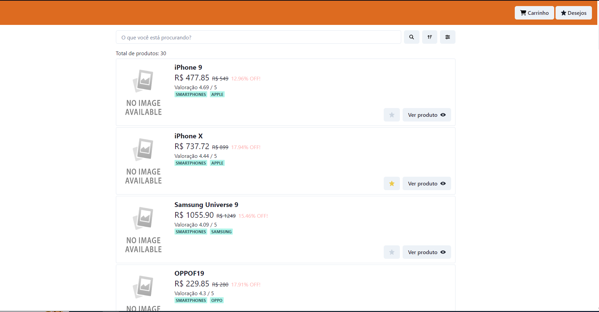
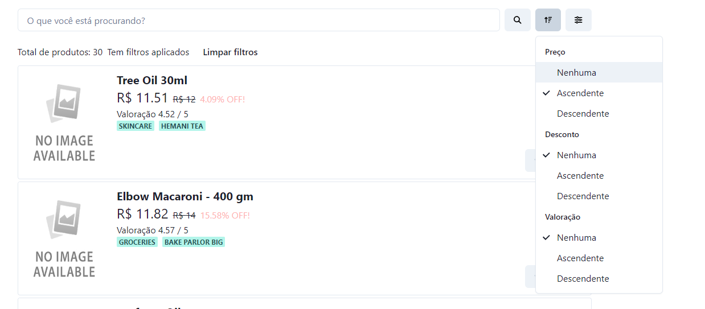
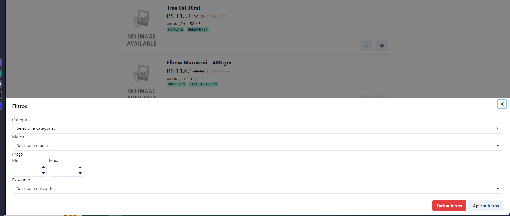
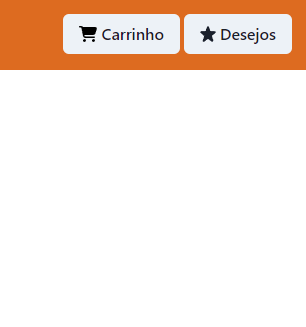
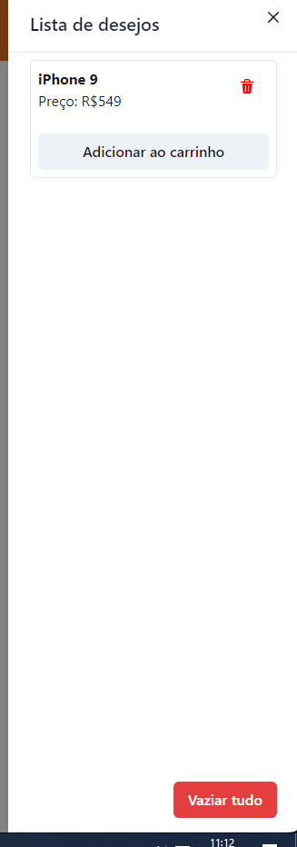
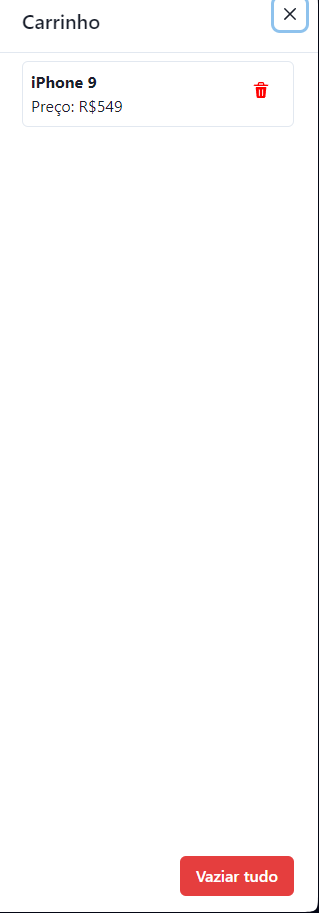
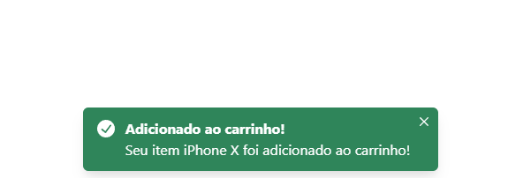
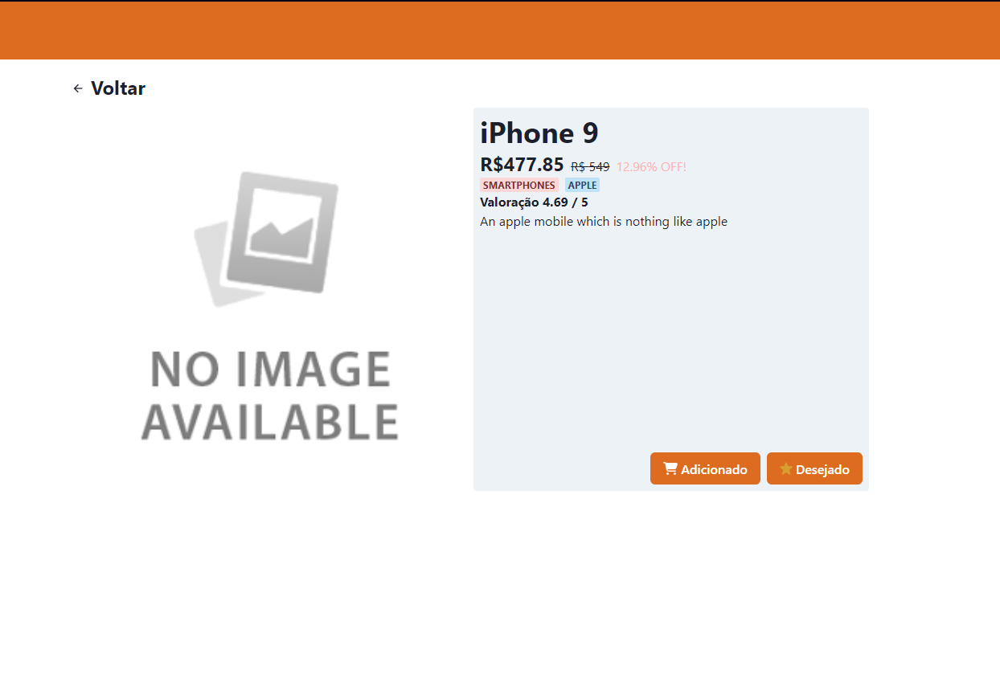

# [PRAZO DE ENTREGA - 7 DIAS CORRIDOS]

# Teste de Desenvolvimento - Plataforma de Comércio Eletrônico

Este projeto é parte de um teste de desenvolvimento para uma plataforma de comércio eletrônico. O objetivo é criar uma aplicação que inclua várias funcionalidades essenciais, como lista de desejos, carrinho de compras, gerenciamento de produtos, entre outros.

## Inicialização

- Faça um fork do repositório do projeto.
- Clone o repositório forkado para o seu ambiente local.
- Utilize _`yarn dev`_ para iniciar o frontend.
- Quando finalizado, envie o link do repositório para dev@acheipneus.com.br.

- A utilização dos templates é opcional

## Funcionalidades Principais

### Lista de Desejos e Carrinho de Compra

- Os usuários podem adicionar produtos à lista de desejos.
- Os usuários podem adicionar produtos ao carrinho de compras.

### Gerenciamento do Carrinho

- Os usuários podem visualizar e gerenciar os itens no carrinho de compras.

### Gerenciamento de Desejos

- Os usuários podem visualizar e gerenciar os itens em sua lista de desejos.

### Listagem de Produtos

- Página ou seção para listar todos os produtos disponíveis na plataforma.

### Ordenação dos Produtos

- Os produtos podem ser ordenados por diferentes critérios, como preço, popularidade, etc.

### Atributos dos Produtos

- Cada produto possui pelo menos 5 atributos associados a ele.

## Requisitos de Desenvolvimento

- **Sem Warnings ou Erros**: O código deve ser desenvolvido de forma a minimizar ou eliminar completamente qualquer aviso ou erro.
- **Lib de Gerenciamento de Estado**: Utilize Redux ou uma lib similar para o gerenciamento do estado da aplicação.
- **Lib Front-End**: Utilize React com componentes funcionais em TypeScript.
- **Versionamento e Conventional Commits**: Utilize Git/GitHub para versionamento do código e siga uma convenção para os comentários.
- **Utilizar JSON para produtos**

### Funcionamento da Aplicação

#### Test de basic store

#### Bibliotecas importantes que usei, alem do React

- Gerenciador de estado global: [Zustand](https://zustand-demo.pmnd.rs). A Zustand é uma biblioteca mais recente que a Redux e oferece uma solução formidável, muito semelhante à Redux, mas muito fácil de usar e nada complexa.
- Interface de usuário: [Chakra-UI](https://chakra-ui.com): biblioteca usada devido à minha familiaridade com ela e à velocidade que ela oferece para criar interfaces de usuário.

Todos os itens podem ser visualizados na página inicial, onde você pode ver uma versão resumida dos itens da loja.

Você também pode pesquisar os objetos, filtrá-los e classificá-los como quiser.

Na lista de carrinhos e na lista de desejos, você pode ver os itens que adicionou ao carrinho e à lista de desejos. Você pode visualizá-los ou excluí-los. Você pode até mesmo adicionar ao carrinho os itens que estão em sua lista de compras.

Você pode adicionar os objetos de que gostou no carrinho a partir dos detalhes do item. Você também pode adicioná-los à lista de desejos.

## Autor

### Nome completo

Samuel Jose Haro

### Dados de contato

- [Email](mailto:samuelharo.dev@gmail.com)
- [Linkedin](https://www.linkedin.com/in/cerealez/)
- [GitHub](https://github.com/CerealeZ)
- [Telefone](https://wa.me/5595981113248)

# Muito obrigado pela oportunidade e estou ansioso para crescer com você.